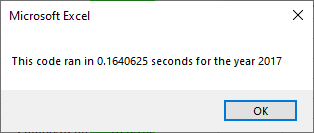
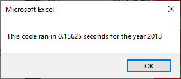

# Optimizing VBA Stock Analysis Code

## Overview
The goal of this project is to optimize the run time for the *allstockanalysis* VBA script.

### Original Code
The orignal VBA script loops over **ALL** the rows of data for each stock symbol. With 12 stocks this isn't an issue time wise, but if we include all the stocks on the stock exchange it can be a massive increase in time.

### Refactored Code
The refactored code attempts to optimize the analysis by only going through the rows of data once! It does this by creating a ticker array for inputs and 3 output arrays indexed by ticker symbol.

The refactored code assumes that the data is sorted by ticker. ***If the data is not sorted by ticker this script will fail!***

## Results

The refactored takes only 16% of the time as compared to the orginal code. This is a signicant increase in performance!

### 2017 Data
The typical run time using the original code was about 1.3 seconds. The refactored code is about 0.2 seconds.
### 2018 Data
The typical run time using the original code was about 1.2 seconds. The refactored code is about 0.2 seconds

### Screen Shots of Refactored Code Performance

## Summary
### What are the advantages or disadvantages of refactoring code?
1. Refactoring code can clean up code and make it easier to read.
2. Refactoring code can optimize the run time of the code and / or reduce the resources needed to run the code.
3. Sometimes, refactoring code to optimize its performance can improve the performance, but can make reading the code more difficult for a human to understand.
### How do these pros and cons apply to refactoring the original VBA script?
1. Refactoring benefited the run time performance of the code as presented in the results section above.
2. Refactoring using the tickerIndex to index the output arrays made the code slightly more difficult to read. The arrays hide the fact that ticker is changing inside of the row loop. With the original code, it was clear that the outer nested loop controled which ticker symbol was currently being analysised. The nested loops are easier for the eye to catch and make sense of what the code is doing.
